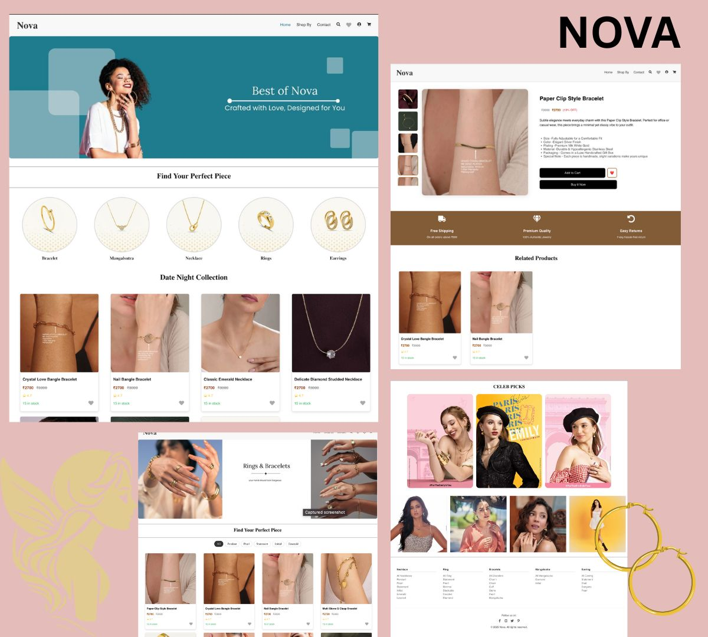

# 💎 NOVA – Jewellery E-Commerce Web App

**NOVA** is a responsive single-page e-commerce web application built using **React.js**, designed to showcase jewellery products dynamically. It allows users to browse, view detailed product information, and manage a personalized wishlist. The project emphasizes component reuse, application state management, and clean UI/UX design.

---

## 📸 Preview

---

## 🛠️ Tech Stack

- **Frontend**: React.js, CSS3
- **Routing**: React Router DOM
- **Design & Prototyping**: Figma, Canva
- **Data Handling**: JSON-based product structure
- **Other Skills Used**:
  - Image Processing
  - Component Reusability
  - useState, useEffect Hooks
  - Local Storage Management
  - Responsive Layout Design

---

## 🚀 Features

- 🛍️ Product grid with dynamic rendering from JSON  
- 🔍 Individual product detail pages with image gallery & description  
- 💖 Wishlist functionality with red/white heart toggle  
- 🛒 Cart page with full product summary and quantity tracking  
- 🛍️ "Buy Now" functionality for direct single-product checkout  
- 💸 Checkout page with user form and real-time item summary  
- 🧹 Cart/Wishlist persists via localStorage  
- 🔁 Seamless navigation using React Router  
- 📱 Fully responsive and optimized for all screens  
- 🧩 Clean, modular components for scalability  

## 💡 Inspiration

This project was built to deepen my understanding of React.js and enhance my frontend development skills. It helped me explore concepts like component-based architecture, state management, routing, and user interaction in a real-world e-commerce scenario.

---
## 🙋‍♀️ Author

<table>
  <tr>
    <td>
      <strong>Ishita Amin</strong> 
      👩‍💻 B.Tech CSE @ Navrachana University 
      📬 <a href="mailto:aminishita30@gmail.com">aminishita30@gmail.com</a> 
      🔗 <a href="https://linkedin.com/in/ishitaamin" target="_blank">LinkedIn</a> 
    </td>
  </tr>
</table>

